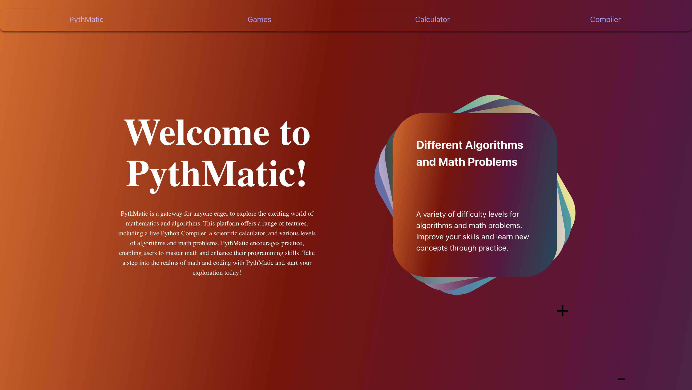
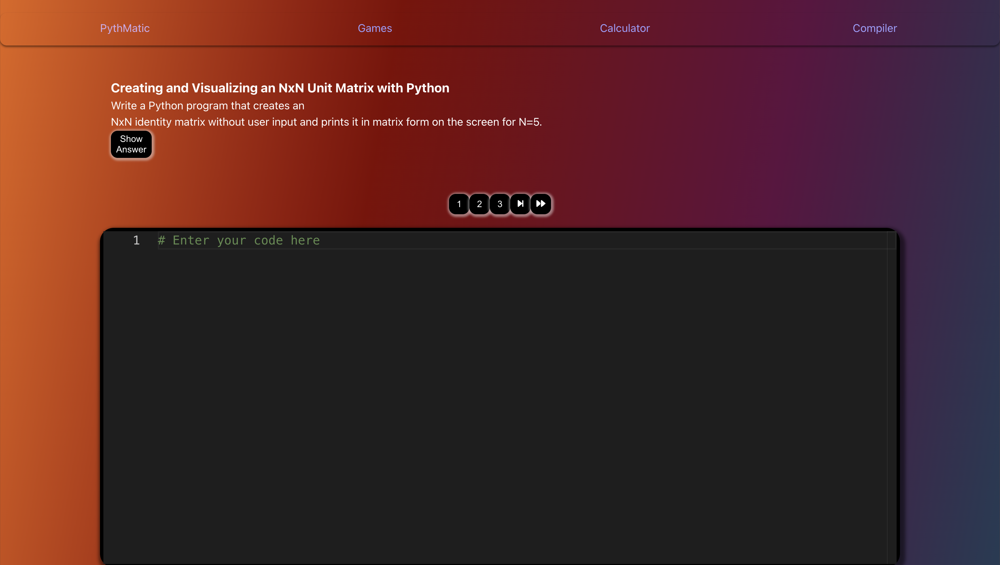
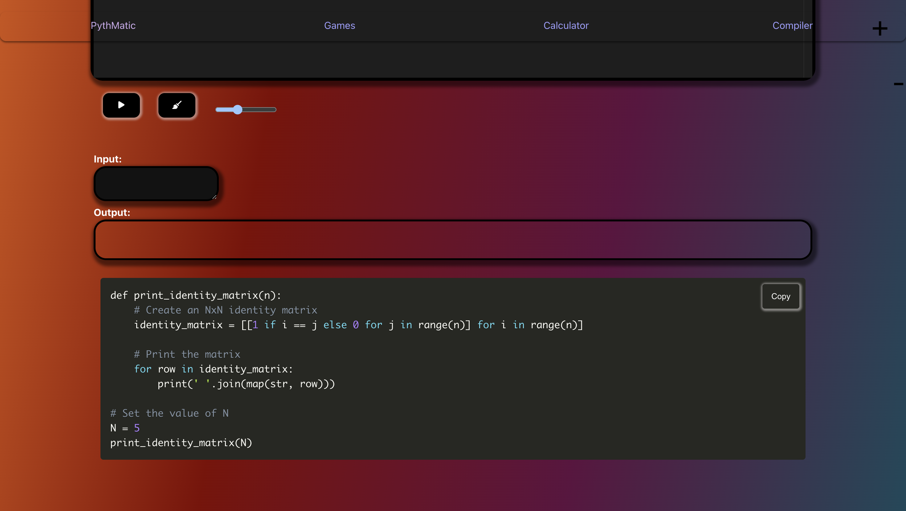

# PythonMathChallenger-with-MERN

## Overview

PythonMathChallenger is a web application designed to challenge users with various math problems. The application is built using the MERN stack (MongoDB, Express, React, Node.js) with Python integrated for generating and evaluating math problems.





## Features

- **Math Challenges:** A variety of math problems generated dynamically.
- **Leaderboard:** Tracks top performers.
- **Responsive Design:** Optimized for both desktop and mobile use.

## Technologies Used

- **Frontend:**
  - React
  - TypeScript
  - Vite

- **Backend:**
  - Node.js
  - Express
  - Python

- **Database:**
  - MongoDB

## Installation

1. **Clone the repository:**
    ```bash
    git clone https://github.com/isinsuatay/PythonMathChallenger-with-MERN.git
    cd PythonMathChallenger-with-MERN
    ```

2. **Install dependencies for the server:**
    ```bash
    cd server
    npm install
    ```

3. **Set up environment variables:**
   Create a `.env` file in the `server` directory and add the necessary environment variables (e.g., database connection string, secret keys).

4. **Run the development server:**
    ```bash
    cd server
    node server.js
    ```

5. **Run the client:**
    ```bash
    npm install
    npm run dev
    ```

## Usage


 **Start a Challenge:**
   - Begin solving math problems and improve your skills.

## Contributing

Contributions are welcome! Please fork the repository and create a pull request with your changes. Ensure your code adheres to the project's coding standards and includes relevant tests.

## License

This project is licensed under the MIT License. See the [LICENSE](LICENSE) file for more details.

## Contact

For any questions or feedback, please open an issue or contact the project maintainer.

---

Enjoy challenging yourself with PythonMathChallenger!
